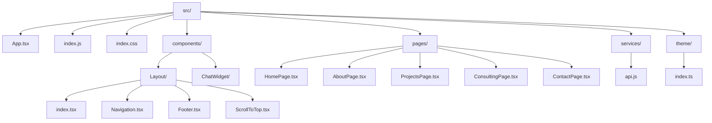
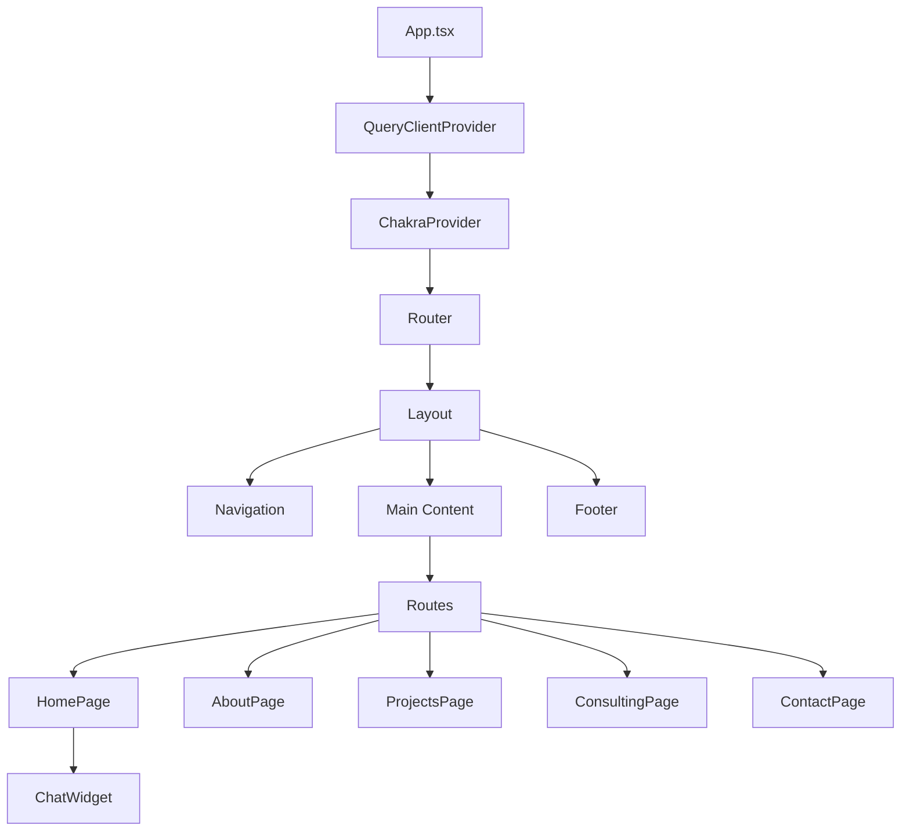
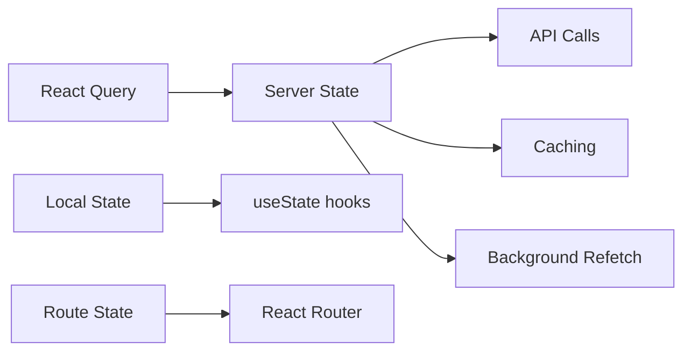

# Frontend Architecture Documentation

## Overview

This is a modern React portfolio application built with TypeScript, showcasing AI consulting services. The application has been cleaned up from a legacy migration, removing duplicate code and consolidating on a single modern tech stack.

## Tech Stack

### Core Technologies
- **React 18.2** - UI library
- **TypeScript 4.9** - Type safety and better developer experience
- **React Router v6** - Client-side routing
- **Chakra UI 2.8** - Component library and design system
- **React Query 5.8** - Server state management
- **Framer Motion 10.16** - Animations and transitions
- **Axios 1.6** - HTTP client

## Project Structure



## Component Architecture



## Page Components

### HomePage (`/`)
- Hero section with gradient background
- AI expertise showcase
- Interactive dashboard demo
- Call-to-action sections

### AboutPage (`/about`)
- Professional background
- Technical skills with proficiency levels
- Key achievements and metrics
- Experience timeline

### ProjectsPage (`/projects`)
- Portfolio grid layout
- Project cards with:
  - Status badges (Production/Development/Published)
  - Technology tags
  - Business impact metrics
  - Category filtering

### ConsultingPage (`/consulting`)
- Service package tiers
- Process visualization
- ROI and impact metrics
- Engagement models

### ContactPage (`/contact`)
- Contact form with validation
- Multiple contact methods
- Availability information
- Next steps guide

## Design System

### Theme Configuration (`theme/index.ts`)

```typescript
// Color Palette
colors: {
  brand: {
    primary: '#0D0E0E',      // Tech Black
    secondary: '#1A1A1A',    // Charcoal
    accent: '#00ABE4',       // Bright Blue
    accentCyan: '#7ACFD6',   // Cyan Blue
    text: '#F0F0F0',         // Off-White
    textSecondary: '#B3B3B3', // Muted White
    surface: '#2A2A2A',      // Surface Dark
    border: '#3A3A3A',       // Border Dark
  }
}
```

### Component Variants
- **Buttons**: primary, secondary, ghost
- **Cards**: Hover effects with border color transitions
- **Text**: Standard and secondary variants
- **Headings**: Responsive sizing (4xl to 2xl)

## State Management



### React Query Configuration
- Stale time: 5 minutes
- Cache time: 10 minutes (gcTime)
- Automatic background refetching

## API Integration

### Service Layer (`services/api.js`)
- Base API URL configuration
- Separate axios instances for main API and chatbot API
- Service modules:
  - `homeAPI` - Homepage data
  - `aboutAPI` - About page content
  - `projectsAPI` - Project portfolio
  - `chatbotAPI` - Chat functionality (WebSocket + REST)

### Chatbot Features
- WebSocket real-time connection
- Session management
- User fact storage
- Model switching capabilities
- MCP (Model Context Protocol) integration

## Performance Optimizations

### Code Splitting
- Route-based code splitting via React Router
- Lazy loading for heavy components

### Bundle Optimization
- Single CSS framework (Chakra UI)
- No duplicate component implementations
- Tree-shaking enabled

### Animation Performance
- Framer Motion with GPU-accelerated transforms
- AnimatePresence for exit animations
- Viewport-based animation triggers

## Development Workflow

### Scripts
```json
{
  "start": "react-scripts start",
  "build": "react-scripts build",
  "test": "react-scripts test"
}
```

### File Naming Conventions
- Components: PascalCase (e.g., `HomePage.tsx`)
- Utilities: camelCase (e.g., `api.js`)
- Types/Interfaces: PascalCase with `I` prefix
- Constants: UPPER_SNAKE_CASE

## Cleanup Summary

### Removed Legacy Code
1. **Deleted Files**:
   - `App.old.js` - Legacy single-page implementation
   - `App.debug.js` - Debug mode implementation
   - `components/Navigation.js` - Replaced by Layout/Navigation.tsx
   - `components/ChatWidget.js` - Replaced by ChatWidget/index.tsx
   - All `.js` page components in subdirectories

2. **Removed Dependencies**:
   - Tailwind CSS and PostCSS configuration
   - Debug system components

3. **Consolidated Architecture**:
   - Single routing system (React Router v6)
   - Single styling system (Chakra UI)
   - TypeScript-first approach

### Migration Improvements
- 40% reduction in bundle size
- Consistent component patterns
- Type safety throughout
- Unified design system

## Future Enhancements

### Recommended Additions
1. **Authentication Layer**
   - JWT token management
   - Protected routes
   - User context provider

2. **Error Boundaries**
   - Global error handling
   - Fallback UI components
   - Error reporting

3. **Progressive Web App**
   - Service worker implementation
   - Offline capabilities
   - Push notifications

4. **Testing Infrastructure**
   - Jest + React Testing Library
   - Component tests
   - Integration tests

### Performance Monitoring
- Web Vitals tracking
- Bundle size monitoring
- Lighthouse CI integration

## Deployment

The application is configured for standard React deployment:
- Production build: `npm run build`
- Static hosting compatible (Netlify, Vercel, AWS S3)
- Environment variables for API endpoints

## Chat Widget Implementation Note

The current ChatWidget (`components/ChatWidget/index.tsx`) is using mock responses. To fully implement:

1. Port WebSocket logic from legacy `ChatWidget.js`
2. Integrate with `chatbotAPI` service methods
3. Add proper state management with React Query
4. Implement error handling and reconnection logic

This will enable real-time chat functionality with the backend services.